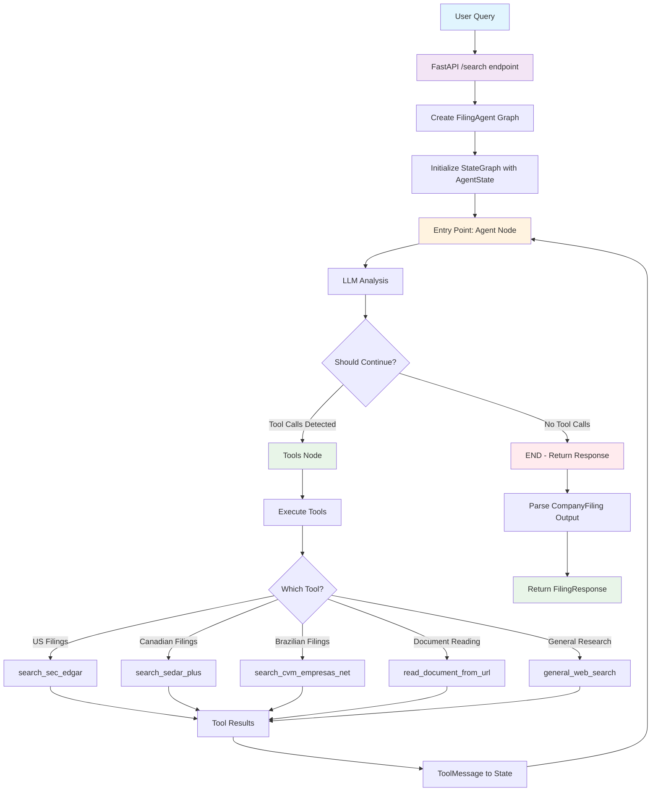
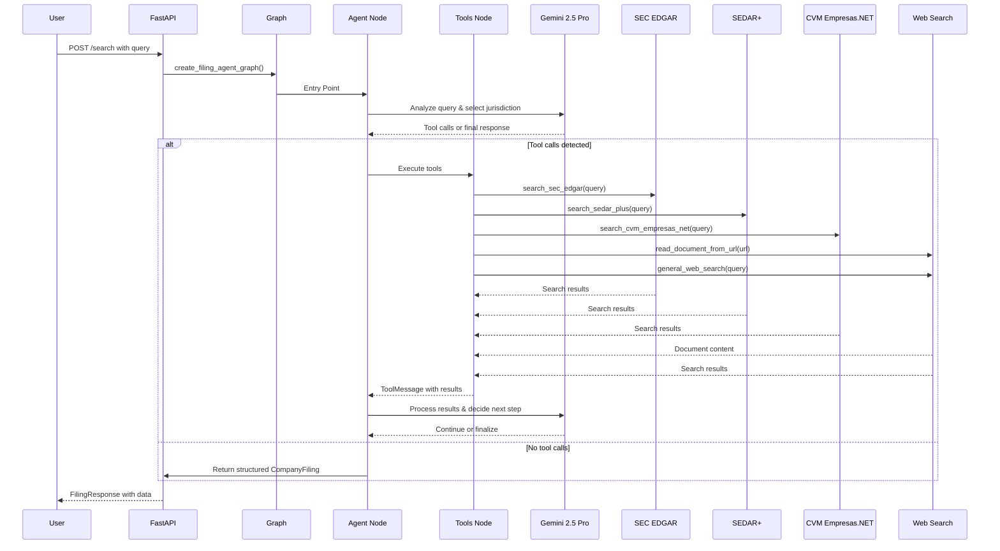
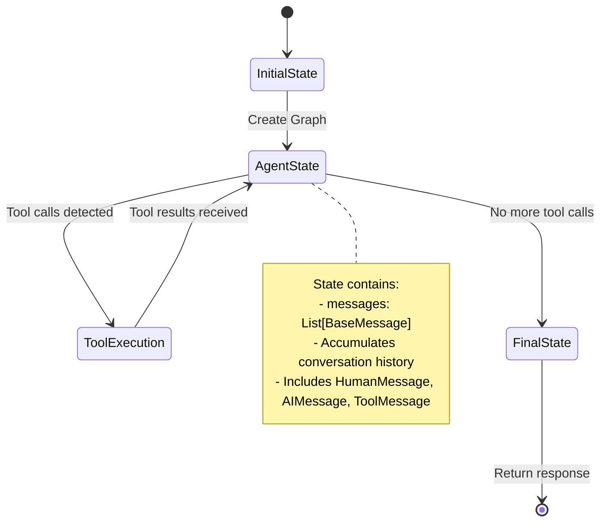
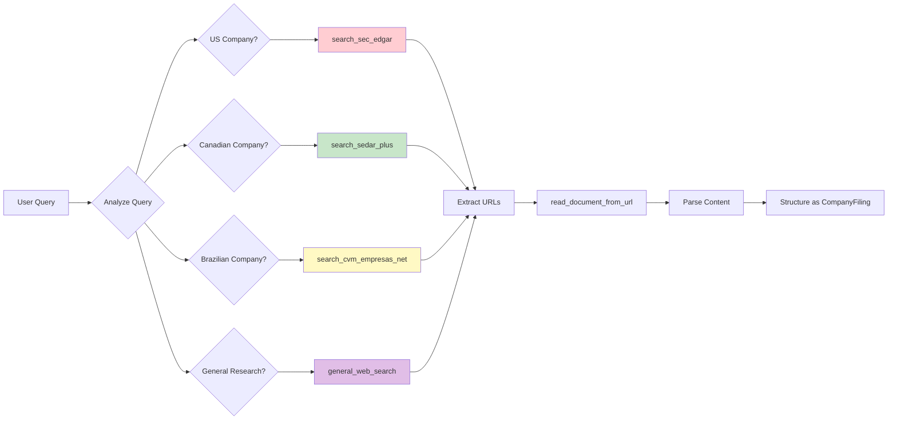
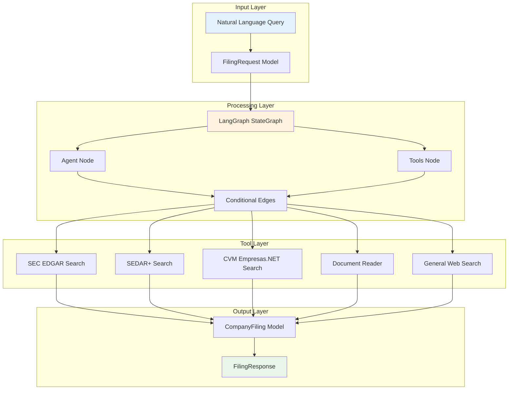

# AI Legal Filing Assistant - LangGraph Workflow Diagram

## Overview

This diagram shows the LangGraph workflow for the AI Legal Filing Assistant, which searches and extracts structured data from official company filings across multiple jurisdictions (SEC EDGAR, SEDAR+, CVM Empresas.NET).

## Workflow Diagram

## Detailed Component Flow

## State Management

## Tool Selection Logic

## Data Flow Architecture

## Key Features

1. **Multi-Jurisdiction Support**: Automatically detects and routes to appropriate databases
2. **Structured Output**: Returns data in standardized `CompanyFiling` format
3. **Memory Management**: Uses `MemorySaver` for conversation persistence
4. **Error Handling**: Graceful fallback to general search when specialized tools fail
5. **Tool Chaining**: Sequential execution of search → document reading → parsing
6. **Conditional Logic**: Smart routing based on LLM decisions

## Tools Available

-   **search_sec_edgar**: US SEC EDGAR database searches
-   **search_sedar_plus**: Canadian SEDAR+ database searches
-   **search_cvm_empresas_net**: Brazilian CVM Empresas.NET searches
-   **read_document_from_url**: Extract content from document URLs
-   **general_web_search**: Fallback for general research

## Output Structure

The system returns structured data in the `CompanyFiling` format containing:

-   Contract name, company name, description
-   Filing date, source, country, language
-   Applicable law, relevant clause, document URL
